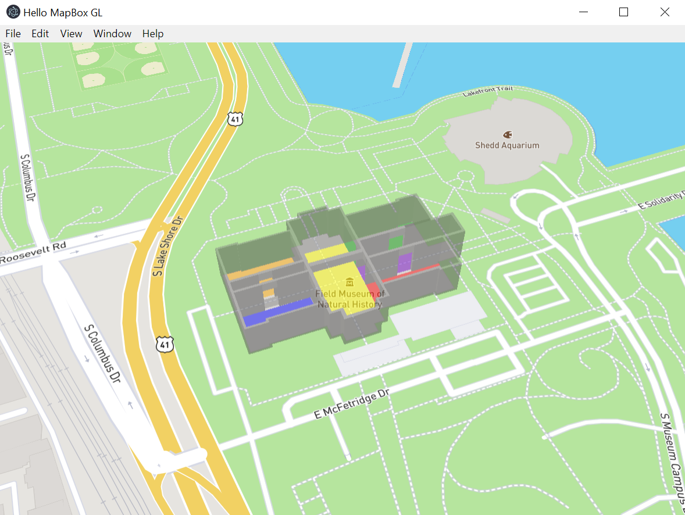

# Electron & GIS

## Why [Electron](https://electronjs.org/)? 
The Electron framework lets you write cross-platform desktop applications
using JavaScript, HTML and CSS. It is based on [Node.js](https://nodejs.org/) and
[Chromium](https://www.chromium.org) and is used by the [Atom
editor](https://github.com/atom/atom) and many other [apps](https://electronjs.org/apps).

### [Mapbox GL](https://www.mapbox.com/mapbox-gl-js/api/) 3D example

***
